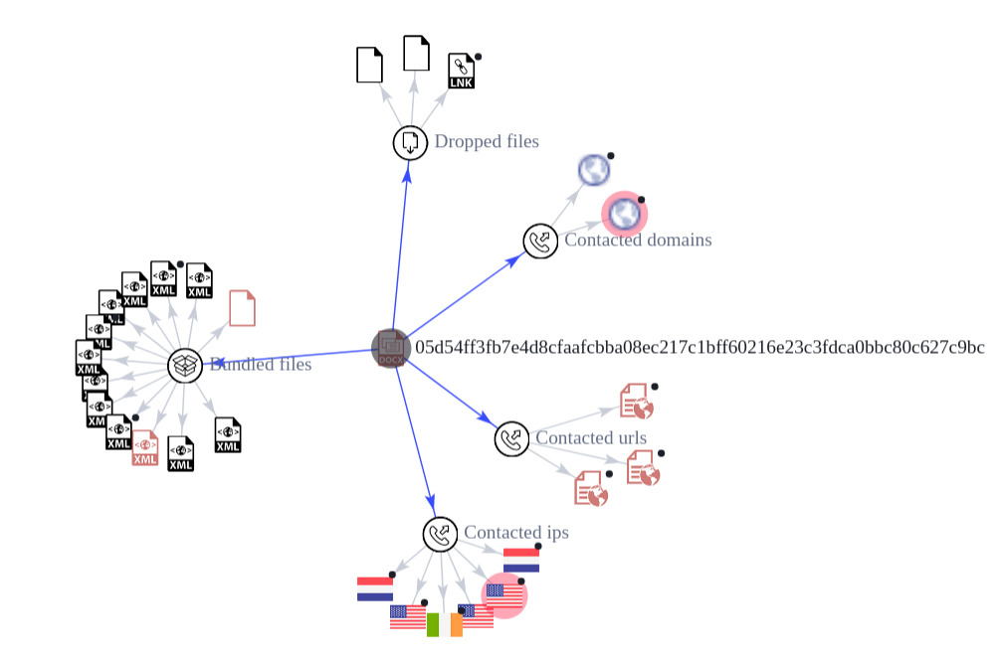
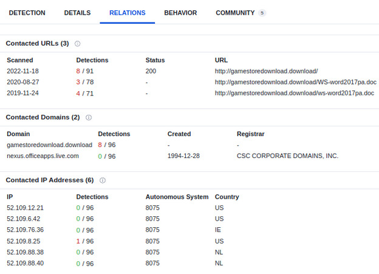
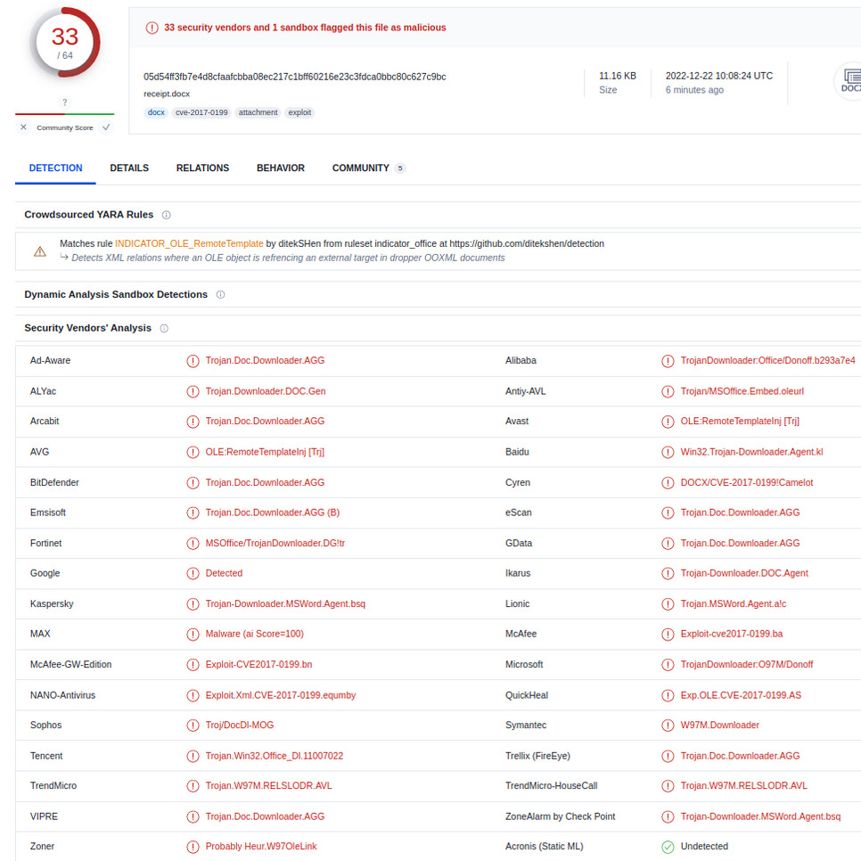

# `receipt.docx` analysis

Date: `Thu 22 Dec 2022 11:56 IST`

# Files and SHA-256 checksums

```
05d54ff3fb7e4d8cfaafcbba08ec217c1bff60216e23c3fdca0bbc80c627c9bc   receipt.docx
```

```
Size 11.16 KB
```

# Question

```
5.  It’s the middle of the night, suddenly you are receiving an email. Since 
    you are not familiar with the sender, and as a security expert, before opening 
    any attachment, you first want to check it. The email message contains .doc 
    file (SHA1 - 776c469861c3ac30aa63d9434449498456864653).

    Use web resources to explain:

    a.  What is the delivery method the attacker is using?
    b.  How is this file related to the domain - gamestoredownload.download?
    c.  The final payload of this malware is the file: gamepa.exe, which tries 
        to steal different types of credentials from the infected host.
        
        i. How would you classify this malware?
        ii. Based on hybrid-analysis report, what is the C2 server of this malware?
```

[3]: https://www.virustotal.com/gui/file/05d54ff3fb7e4d8cfaafcbba08ec217c1bff60216e23c3fdca0bbc80c627c9bc
[4]: https://www.virustotal.com/gui/file/05d54ff3fb7e4d8cfaafcbba08ec217c1bff60216e23c3fdca0bbc80c627c9bc/details
[5]: https://www.virustotal.com/gui/file/05d54ff3fb7e4d8cfaafcbba08ec217c1bff60216e23c3fdca0bbc80c627c9bc/relations
[6]: https://www.virustotal.com/gui/file/05d54ff3fb7e4d8cfaafcbba08ec217c1bff60216e23c3fdca0bbc80c627c9bc/behavior

[7]: https://hybrid-analysis.com/sample/05d54ff3fb7e4d8cfaafcbba08ec217c1bff60216e23c3fdca0bbc80c627c9bc
[8]: https://hybrid-analysis.com/sample/05d54ff3fb7e4d8cfaafcbba08ec217c1bff60216e23c3fdca0bbc80c627c9bc/5a86bd357ca3e144126c2435


# 5. Virustotal `776c469861c3ac30aa63d9434449498456864653` [[3]]

`Screenshot 1: overview graph`




# Details > Basic Properties: [[4]]

```
SHA-1	776c469861c3ac30aa63d9434449498456864653
SHA-256	05d54ff3fb7e4d8cfaafcbba08ec217c1bff60216e23c3fdca0bbc80c627c9bc
```

# Details > History: [[4]]

```
Creation Time	2017-09-22 19:02:00 UTC
```

# 5a. Delivery method

Delivered via MS Word (.docx) file attachment in a phishing email.


# 5b. Relation to `gamestoredownload.download` [[5]]

`Screenshot 2: relations contacted urls, contacted domains, IP addresses`




## Relations > Contacted URLs: [[5]]

```
http://gamestoredownload.download/
http://gamestoredownload.download/WS-word2017pa.doc
http://gamestoredownload.download/ws-word2017pa.doc
```

## Relations > Contacted Domains: [[5]]

```
gamestoredownload.download
nexus.officeapps.live.com
```

## Relations > Contacted IP Addresses: [[5]]

```
52.109.12.21
52.109.6.42
52.109.76.36
52.109.8.25
52.109.88.38
52.109.88.40
```

# 5c. `gamepa.exe`:

# 5ci. Clasification [[3]]:

## Detection > Security Vendors' Analysis: [[3]]

`Screenshot 3: 33 detections and vendor analysis`




## 5cii. Based on [hybrid-analysis.com][8] [[8]], what is C2 server of malware?

## Analysis Overview [[7]]

```
Size: 11KiB
Type: docx office
SHA256: 05d54ff3fb7e4d8cfaafcbba08ec217c1bff60216e23c3fdca0bbc80c627c9bc
Operating System: Windows 
```

```
Threat Score: 87/100
AV Detection: 62%
Labeled as: CVE-2017-0199
```

## [hybrid-analysis][8]: [[8]]

```
Guest System: Windows 7 32 bit, Home Premium, 6.1 (build 7601), Service Pack 1, Office 2010 v14.0.4
Report generated by Falcon Sandbox v7.30 © Hybrid Analysis
```

## [hybrid-analysis][7] > Classification (TrID): [[7]]
```
91.8% (.DOCX) Word Microsoft Office Open XML Format document
8.1% (.ZIP) ZIP compressed archive
```

## [virustotal][5] > Relations > Contacted URLs: [[5]]

```
Scanned         Detections	    Status	    URL

2022-11-18	    8/91            200         http://gamestoredownload.download/
2020-08-27	    3/78            -           http://gamestoredownload.download/WS-word2017pa.doc
2019-11-24	    4/71            -           http://gamestoredownload.download/ws-word2017pa.doc
```

## [virustotal][5] > Relations > Conctacted Domains: [[5]]

```
Domain                          Detections

gamestoredownload.download	    8/96
```

## [virustotal][5] > Relations > Contacted IP Addresses: [[5]]

```
IP              Detections      Autonomous System   Country

52.109.8.25     1/96            8075                US
```
