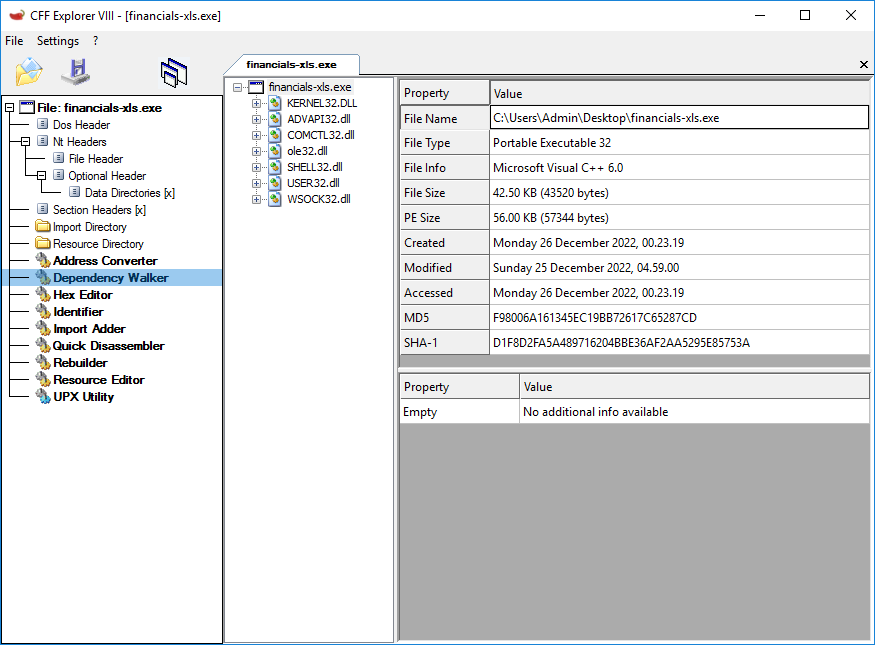
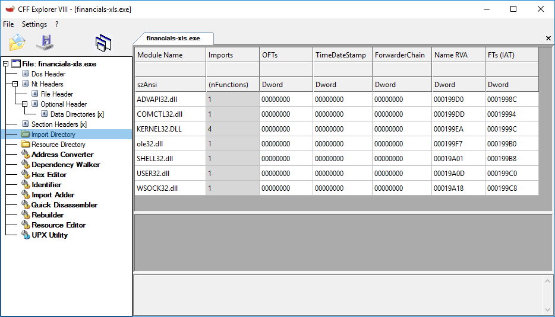
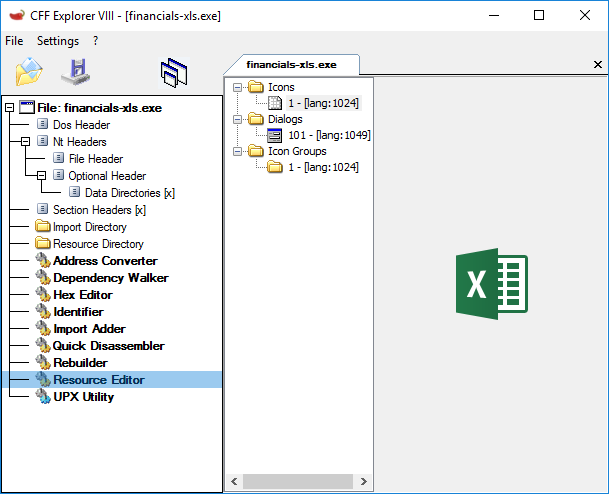
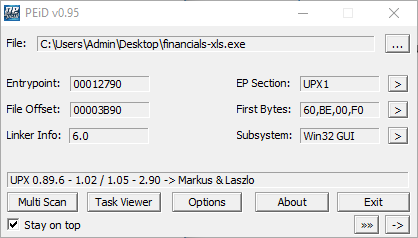
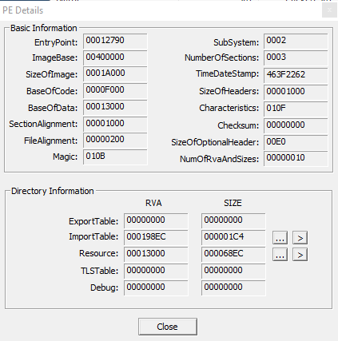
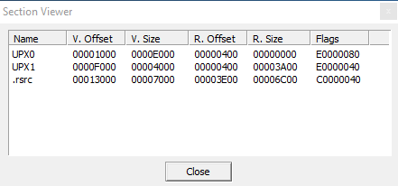

# `financials-xls.exe` analysis

Date: `Tue 27 Dec 2022 01:31:43 IST`

# Guidelines:

- IoC (Indicators of Compromise)
    - URLs, IPs, domains, packed/unpacked, files created, registry keys, process, HTML pages, HTTP requests, DNS requests, hashes
- Online resources
    - VirusTotal, hybrid-analysis
- Strings
- Sections permissions
- Suspicious DLLs, suspicious functions
- Malware persistency
    - Registry keys?
- Resources
    - Images, icons, documents
- System changes, network traffic, etc
- Based on the analysis:
    - What the malware is doing?
    - What kind of malware?

# Static analysis

## CFF Explorer > Dependency Walker

DLL dependencies

## CFF Explorer > Import Directory

## CFF Explorer > Resource Editor

Icon image

## PEiD

## PEiD > PE Details

`TimeDateStamp` as hex timestamp, `Magic` number to determine file type, `ExportTable`, `ImportTable`.

## PEiD > Section Viewer

UPX sections, `.rsrc`

# Dynamic analysis